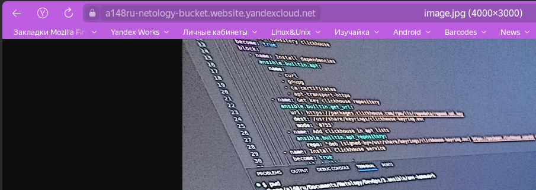
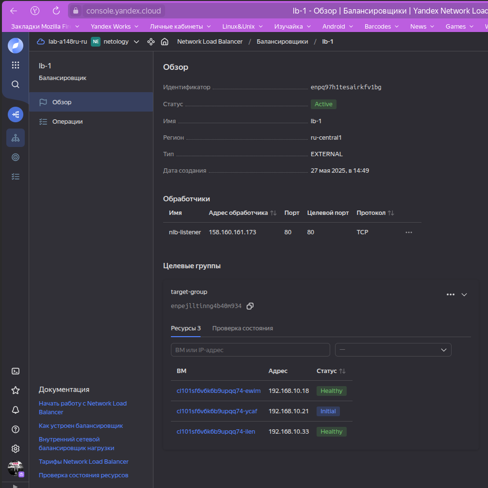

## Создать бакет и группу вм с балансироввщиком

1. Удаляем одну из ВМ и проверяем доступность



2. ВМ восстаноавливается после удаления


Вывод консоли 
```bash
 ~/Documents/Netology/DevOps/org/hw-bal/src  terraform apply   

Terraform used the selected providers to generate the following execution plan. Resource actions are indicated with the following symbols:
  + create
 <= read (data resources)

Terraform will perform the following actions:

  # data.template_file.cloudinit will be read during apply
  # (config refers to values not yet known)
 <= data "template_file" "cloudinit" {
      + id       = (known after apply)
      + rendered = (known after apply)
      + template = <<-EOT
            #cloud-config
            users:
              - name: ubuntu
                groups: sudo
                shell: /bin/bash
                sudo: ["ALL=(ALL) NOPASSWD:ALL"]
                ssh_authorized_keys:
                  - ${ssh_public_key}
            package_update: true
            package_upgrade: false
            # packages:
            #  - vim
            #  - nginx
            write_files:
              - path: "/var/www/html/index.html"
                permissions: "644"
                owner: www-data:www-data
                content: |
                  <html>
                  <head>
                  </head>
                  <body>
                  <p><a href="${link_image}">image</a></p>
                  </body>
                  </html>
                defer: true
        EOT
      + vars     = {
          + "link_image"     = (known after apply)
          + "ssh_public_key" = (sensitive value)
        }
    }

  # yandex_compute_instance_group.ig-1 will be created
  + resource "yandex_compute_instance_group" "ig-1" {
      + created_at          = (known after apply)
      + deletion_protection = false
      + folder_id           = "b1gih35rpnn00onvnk09"
      + id                  = (known after apply)
      + instances           = (known after apply)
      + name                = "instance-group"
      + service_account_id  = (known after apply)
      + status              = (known after apply)

      + allocation_policy {
          + zones = [
              + "ru-central1-b",
            ]
        }

      + deploy_policy {
          + max_creating     = 0
          + max_deleting     = 0
          + max_expansion    = 0
          + max_unavailable  = 1
          + startup_duration = 0
          + strategy         = (known after apply)
        }

      + instance_template {
          + labels      = (known after apply)
          + metadata    = (known after apply)
          + platform_id = "standard-v3"

          + boot_disk {
              + device_name = (known after apply)
              + mode        = "READ_WRITE"

              + initialize_params {
                  + image_id    = "fd827b91d99psvq5fjit"
                  + size        = (known after apply)
                  + snapshot_id = (known after apply)
                  + type        = "network-hdd"
                }
            }

          + metadata_options (known after apply)

          + network_interface {
              + ip_address   = (known after apply)
              + ipv4         = true
              + ipv6         = (known after apply)
              + ipv6_address = (known after apply)
              + nat          = (known after apply)
              + network_id   = (known after apply)
              + subnet_ids   = (known after apply)
            }

          + resources {
              + core_fraction = 100
              + cores         = 2
              + memory        = 2
            }

          + scheduling_policy (known after apply)
        }

      + load_balancer {
          + status_message           = (known after apply)
          + target_group_description = "Целевая группа Network Load Balancer"
          + target_group_id          = (known after apply)
          + target_group_name        = "target-group"
        }

      + scale_policy {
          + fixed_scale {
              + size = 3
            }
        }
    }

  # yandex_iam_service_account.netology-sa will be created
  + resource "yandex_iam_service_account" "netology-sa" {
      + created_at = (known after apply)
      + folder_id  = (known after apply)
      + id         = (known after apply)
      + name       = "netology-sa"
    }

  # yandex_iam_service_account_static_access_key.sa-static-key will be created
  + resource "yandex_iam_service_account_static_access_key" "sa-static-key" {
      + access_key                   = (known after apply)
      + created_at                   = (known after apply)
      + description                  = "static access key"
      + encrypted_secret_key         = (known after apply)
      + id                           = (known after apply)
      + key_fingerprint              = (known after apply)
      + output_to_lockbox_version_id = (known after apply)
      + secret_key                   = (sensitive value)
      + service_account_id           = (known after apply)
    }

  # yandex_lb_network_load_balancer.lb-1 will be created
  + resource "yandex_lb_network_load_balancer" "lb-1" {
      + allow_zonal_shift   = (known after apply)
      + created_at          = (known after apply)
      + deletion_protection = (known after apply)
      + folder_id           = (known after apply)
      + id                  = (known after apply)
      + name                = "lb-1"
      + region_id           = (known after apply)
      + type                = "external"

      + attached_target_group {
          + target_group_id = (known after apply)

          + healthcheck {
              + healthy_threshold   = 2
              + interval            = 2
              + name                = "http"
              + timeout             = 1
              + unhealthy_threshold = 2

              + http_options {
                  + path = "/index.html"
                  + port = 80
                }
            }
        }

      + listener {
          + name        = "nlb-listener"
          + port        = 80
          + protocol    = (known after apply)
          + target_port = (known after apply)

          + external_address_spec {
              + address    = (known after apply)
              + ip_version = "ipv4"
            }
        }
    }

  # yandex_resourcemanager_folder_iam_member.bucket-sa will be created
  + resource "yandex_resourcemanager_folder_iam_member" "bucket-sa" {
      + folder_id = "b1gih35rpnn00onvnk09"
      + id        = (known after apply)
      + member    = (known after apply)
      + role      = "storage.admin"
    }

  # yandex_resourcemanager_folder_iam_member.compute-editor will be created
  + resource "yandex_resourcemanager_folder_iam_member" "compute-editor" {
      + folder_id = "b1gih35rpnn00onvnk09"
      + id        = (known after apply)
      + member    = (known after apply)
      + role      = "compute.editor"
    }

  # yandex_resourcemanager_folder_iam_member.load-balancer-editor will be created
  + resource "yandex_resourcemanager_folder_iam_member" "load-balancer-editor" {
      + folder_id = "b1gih35rpnn00onvnk09"
      + id        = (known after apply)
      + member    = (known after apply)
      + role      = "load-balancer.editor"
    }

  # yandex_storage_bucket.bucket will be created
  + resource "yandex_storage_bucket" "bucket" {
      + access_key            = (known after apply)
      + bucket                = "a148ru-netology-bucket"
      + bucket_domain_name    = (known after apply)
      + default_storage_class = (known after apply)
      + folder_id             = "b1gih35rpnn00onvnk09"
      + force_destroy         = false
      + id                    = (known after apply)
      + max_size              = 104857600
      + secret_key            = (sensitive value)
      + website_domain        = (known after apply)
      + website_endpoint      = (known after apply)

      + anonymous_access_flags {
          + list = true
          + read = true
        }

      + versioning (known after apply)

      + website {
          + error_document = "error.html"
          + index_document = "index.html"
        }
    }

  # yandex_storage_object.test-object will be created
  + resource "yandex_storage_object" "test-object" {
      + access_key   = (known after apply)
      + acl          = "private"
      + bucket       = "a148ru-netology-bucket"
      + content_type = (known after apply)
      + id           = (known after apply)
      + key          = "image.jpg"
      + secret_key   = (sensitive value)
      + source       = "./files/image.jpg"
    }

  # yandex_vpc_network.network will be created
  + resource "yandex_vpc_network" "network" {
      + created_at                = (known after apply)
      + default_security_group_id = (known after apply)
      + folder_id                 = (known after apply)
      + id                        = (known after apply)
      + labels                    = (known after apply)
      + name                      = "network-1"
      + subnet_ids                = (known after apply)
    }

  # yandex_vpc_subnet.subnet will be created
  + resource "yandex_vpc_subnet" "subnet" {
      + created_at     = (known after apply)
      + folder_id      = (known after apply)
      + id             = (known after apply)
      + labels         = (known after apply)
      + name           = "subnet-1"
      + network_id     = (known after apply)
      + v4_cidr_blocks = [
          + "192.168.10.0/24",
        ]
      + v6_cidr_blocks = (known after apply)
      + zone           = "ru-central1-b"
    }

Plan: 11 to add, 0 to change, 0 to destroy.

Changes to Outputs:
  + lb-link = (known after apply)

Do you want to perform these actions?
  Terraform will perform the actions described above.
  Only 'yes' will be accepted to approve.

  Enter a value: yes

yandex_vpc_network.network: Creating...
yandex_vpc_network.network: Creation complete after 2s [id=enp379d3305fnj1i3l0q]
yandex_vpc_subnet.subnet: Creating...
yandex_vpc_subnet.subnet: Creation complete after 1s [id=e2loavhmpc54doqgns3k]
yandex_iam_service_account.netology-sa: Creating...
yandex_iam_service_account.netology-sa: Creation complete after 3s [id=ajeqo83q6jesnf9takdv]
yandex_iam_service_account_static_access_key.sa-static-key: Creating...
yandex_iam_service_account_static_access_key.sa-static-key: Creation complete after 2s [id=ajegig1vc8jo111ur5t7]
yandex_resourcemanager_folder_iam_member.compute-editor: Creating...
yandex_resourcemanager_folder_iam_member.load-balancer-editor: Creating...
yandex_resourcemanager_folder_iam_member.bucket-sa: Creating...
yandex_resourcemanager_folder_iam_member.compute-editor: Creation complete after 2s [id=b1gih35rpnn00onvnk09/compute.editor/serviceAccount:ajeqo83q6jesnf9takdv]
yandex_resourcemanager_folder_iam_member.bucket-sa: Creation complete after 5s [id=b1gih35rpnn00onvnk09/storage.admin/serviceAccount:ajeqo83q6jesnf9takdv]
yandex_storage_bucket.bucket: Creating...
yandex_resourcemanager_folder_iam_member.load-balancer-editor: Creation complete after 7s [id=b1gih35rpnn00onvnk09/load-balancer.editor/serviceAccount:ajeqo83q6jesnf9takdv]
yandex_storage_bucket.bucket: Still creating... [10s elapsed]
yandex_storage_bucket.bucket: Creation complete after 16s [id=a148ru-netology-bucket]
yandex_storage_object.test-object: Creating...
yandex_storage_object.test-object: Creation complete after 2s [id=image.jpg]
data.template_file.cloudinit: Reading...
data.template_file.cloudinit: Read complete after 0s [id=3ec7670be377bb1e18eb850020828e55ddf6bad7f69b4831cf2f28d4cab9dd9c]
yandex_compute_instance_group.ig-1: Creating...
yandex_compute_instance_group.ig-1: Still creating... [10s elapsed]
yandex_compute_instance_group.ig-1: Still creating... [20s elapsed]
yandex_compute_instance_group.ig-1: Still creating... [30s elapsed]
yandex_compute_instance_group.ig-1: Still creating... [40s elapsed]
yandex_compute_instance_group.ig-1: Still creating... [50s elapsed]
yandex_compute_instance_group.ig-1: Still creating... [1m0s elapsed]
yandex_compute_instance_group.ig-1: Still creating... [1m10s elapsed]
yandex_compute_instance_group.ig-1: Creation complete after 1m16s [id=cl101sf6v6k6b9upqq74]
yandex_lb_network_load_balancer.lb-1: Creating...
yandex_lb_network_load_balancer.lb-1: Creation complete after 4s [id=enpq97h1tesairkfv1bg]

Apply complete! Resources: 11 added, 0 changed, 0 destroyed.

Outputs:

lb-link = "http://158.160.161.173"
 ~/Documents/Netology/DevOps/org/hw-bal/src  
 ```