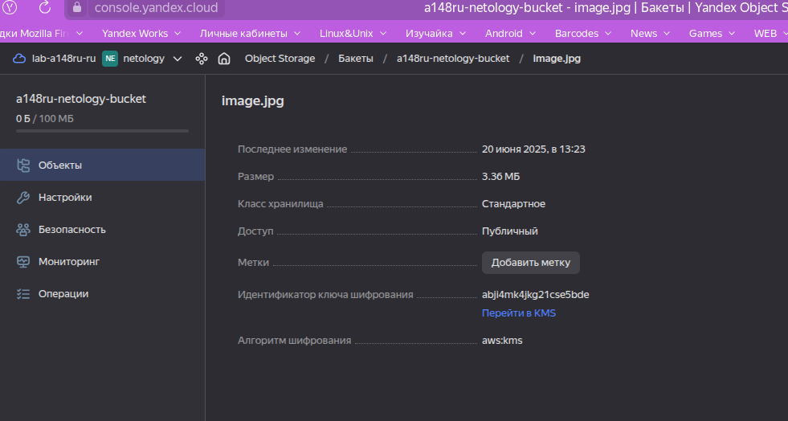
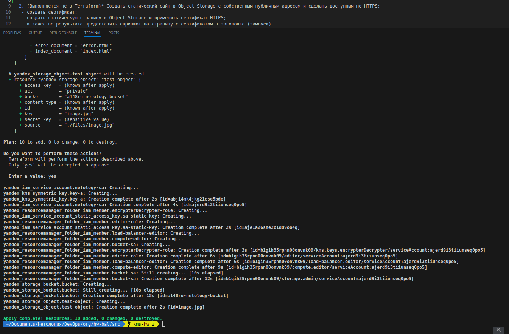

## Задание 1. Yandex Cloud
1. С помощью ключа в KMS необходимо зашифровать содержимое бакета:
 - создать ключ в KMS;
 - с помощью ключа зашифровать содержимое бакета, созданного ранее.

 
 

```bash
 ~/Documents/Нетология/DevOps/org/hw-bal/src   kms-hw ±  terraform apply

Terraform used the selected providers to generate the following execution plan. Resource actions are indicated with the following symbols:
  + create

Terraform will perform the following actions:

  # yandex_iam_service_account.netology-sa will be created
  + resource "yandex_iam_service_account" "netology-sa" {
      + created_at = (known after apply)
      + folder_id  = (known after apply)
      + id         = (known after apply)
      + name       = "netology-sa"
    }

  # yandex_iam_service_account_static_access_key.sa-static-key will be created
  + resource "yandex_iam_service_account_static_access_key" "sa-static-key" {
      + access_key                   = (known after apply)
      + created_at                   = (known after apply)
      + description                  = "static access key"
      + encrypted_secret_key         = (known after apply)
      + id                           = (known after apply)
      + key_fingerprint              = (known after apply)
      + output_to_lockbox_version_id = (known after apply)
      + secret_key                   = (sensitive value)
      + service_account_id           = (known after apply)
    }

  # yandex_kms_symmetric_key.key-a will be created
  + resource "yandex_kms_symmetric_key" "key-a" {
      + created_at          = (known after apply)
      + default_algorithm   = "AES_256"
      + deletion_protection = false
      + description         = "Ключ для шифрования бакетов"
      + folder_id           = (known after apply)
      + id                  = (known after apply)
      + name                = "bucket-key"
      + rotated_at          = (known after apply)
      + rotation_period     = "168h"
      + status              = (known after apply)
    }

  # yandex_resourcemanager_folder_iam_member.bucket-sa will be created
  + resource "yandex_resourcemanager_folder_iam_member" "bucket-sa" {
      + folder_id = "b1gih35rpnn00onvnk09"
      + id        = (known after apply)
      + member    = (known after apply)
      + role      = "storage.admin"
    }

  # yandex_resourcemanager_folder_iam_member.compute-editor will be created
  + resource "yandex_resourcemanager_folder_iam_member" "compute-editor" {
      + folder_id = "b1gih35rpnn00onvnk09"
      + id        = (known after apply)
      + member    = (known after apply)
      + role      = "compute.editor"
    }

  # yandex_resourcemanager_folder_iam_member.editor-role will be created
  + resource "yandex_resourcemanager_folder_iam_member" "editor-role" {
      + folder_id = "b1gih35rpnn00onvnk09"
      + id        = (known after apply)
      + member    = (known after apply)
      + role      = "editor"
    }

  # yandex_resourcemanager_folder_iam_member.encrypterDecrypter-role will be created
  + resource "yandex_resourcemanager_folder_iam_member" "encrypterDecrypter-role" {
      + folder_id = "b1gih35rpnn00onvnk09"
      + id        = (known after apply)
      + member    = (known after apply)
      + role      = "kms.keys.encrypterDecrypter"
    }

  # yandex_resourcemanager_folder_iam_member.load-balancer-editor will be created
  + resource "yandex_resourcemanager_folder_iam_member" "load-balancer-editor" {
      + folder_id = "b1gih35rpnn00onvnk09"
      + id        = (known after apply)
      + member    = (known after apply)
      + role      = "load-balancer.editor"
    }

  # yandex_storage_bucket.bucket will be created
  + resource "yandex_storage_bucket" "bucket" {
      + access_key            = (known after apply)
      + bucket                = "a148ru-netology-bucket"
      + bucket_domain_name    = (known after apply)
      + default_storage_class = (known after apply)
      + folder_id             = "b1gih35rpnn00onvnk09"
      + force_destroy         = false
      + id                    = (known after apply)
      + max_size              = 104857600
      + secret_key            = (sensitive value)
      + website_domain        = (known after apply)
      + website_endpoint      = (known after apply)

      + anonymous_access_flags {
          + list = true
          + read = true
        }

      + server_side_encryption_configuration {
          + rule {
              + apply_server_side_encryption_by_default {
                  + kms_master_key_id = (known after apply)
                  + sse_algorithm     = "aws:kms"
                }
            }
        }

      + versioning (known after apply)

      + website {
          + error_document = "error.html"
          + index_document = "index.html"
        }
    }

  # yandex_storage_object.test-object will be created
  + resource "yandex_storage_object" "test-object" {
      + access_key   = (known after apply)
      + acl          = "private"
      + bucket       = "a148ru-netology-bucket"
      + content_type = (known after apply)
      + id           = (known after apply)
      + key          = "image.jpg"
      + secret_key   = (sensitive value)
      + source       = "./files/image.jpg"
    }

Plan: 10 to add, 0 to change, 0 to destroy.

Do you want to perform these actions?
  Terraform will perform the actions described above.
  Only 'yes' will be accepted to approve.

  Enter a value: yes

yandex_iam_service_account.netology-sa: Creating...
yandex_kms_symmetric_key.key-a: Creating...
yandex_kms_symmetric_key.key-a: Creation complete after 2s [id=abji4mk4jkg21cse5bde]
yandex_iam_service_account.netology-sa: Creation complete after 4s [id=ajerd9i3tiiunseq0po5]
yandex_resourcemanager_folder_iam_member.encrypterDecrypter-role: Creating...
yandex_iam_service_account_static_access_key.sa-static-key: Creating...
yandex_resourcemanager_folder_iam_member.editor-role: Creating...
yandex_iam_service_account_static_access_key.sa-static-key: Creation complete after 2s [id=aje1a26sne2b1d89ob4q]
yandex_resourcemanager_folder_iam_member.load-balancer-editor: Creating...
yandex_resourcemanager_folder_iam_member.compute-editor: Creating...
yandex_resourcemanager_folder_iam_member.bucket-sa: Creating...
yandex_resourcemanager_folder_iam_member.encrypterDecrypter-role: Creation complete after 3s [id=b1gih35rpnn00onvnk09/kms.keys.encrypterDecrypter/serviceAccount:ajerd9i3tiiunseq0po5]
yandex_resourcemanager_folder_iam_member.editor-role: Creation complete after 6s [id=b1gih35rpnn00onvnk09/editor/serviceAccount:ajerd9i3tiiunseq0po5]
yandex_resourcemanager_folder_iam_member.load-balancer-editor: Creation complete after 6s [id=b1gih35rpnn00onvnk09/load-balancer.editor/serviceAccount:ajerd9i3tiiunseq0po5]
yandex_resourcemanager_folder_iam_member.compute-editor: Creation complete after 9s [id=b1gih35rpnn00onvnk09/compute.editor/serviceAccount:ajerd9i3tiiunseq0po5]
yandex_resourcemanager_folder_iam_member.bucket-sa: Still creating... [10s elapsed]
yandex_resourcemanager_folder_iam_member.bucket-sa: Creation complete after 12s [id=b1gih35rpnn00onvnk09/storage.admin/serviceAccount:ajerd9i3tiiunseq0po5]
yandex_storage_bucket.bucket: Creating...
yandex_storage_bucket.bucket: Still creating... [10s elapsed]
yandex_storage_bucket.bucket: Creation complete after 18s [id=a148ru-netology-bucket]
yandex_storage_object.test-object: Creating...
yandex_storage_object.test-object: Creation complete after 2s [id=image.jpg]

Apply complete! Resources: 10 added, 0 changed, 0 destroyed.
 ~/Documents/Нетология/DevOps/org/hw-bal/src   kms-hw ±  
 ```

 
2. (Выполняется не в Terraform)* Создать статический сайт в Object Storage c собственным публичным адресом и сделать доступным по HTTPS:
 - создать сертификат;
 - создать статическую страницу в Object Storage и применить сертификат HTTPS;
 - в качестве результата предоставить скриншот на страницу с сертификатом в заголовке (замочек).